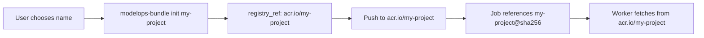

# Bundle Workflow and State Flow

This document traces how bundle configuration flows through the ModelOps system, from infrastructure provisioning to job execution.

## Overview

The bundle system involves multiple layers of configuration that must coordinate:
1. **Infrastructure** (Pulumi) creates cloud resources
2. **BundleEnvironment** caches infrastructure outputs
3. **Bundle projects** use environment config to determine registry location
4. **Workers** fetch bundles using fully-qualified references

## The Key Insight

**The project name (e.g., "simulation-workflow", "my-model", "epi-sim") is the KEY that determines the repository name in the registry.** This name:
- Is chosen by the user when running `modelops-bundle init <project-name>`
- Becomes part of the registry reference: `<registry>/<project-name>`
- Must flow consistently through the entire system
- Should NEVER be hardcoded

## Phase 1: Infrastructure Provisioning

### Command: `mops infra up`

1. **ACR Name Generation** (`src/modelops/core/naming.py`)
   ```python
   # For dev environment with per-user registries:
   acr_name = StackNaming.get_acr_name(env="dev", suffix="vsb")
   # Result: "modelopsdevacrvsb"
   # Pattern: {project_prefix}{env}acr{username}
   ```

2. **Registry Creation** (`src/modelops/infra/components/registry.py`)
   - Creates Azure Container Registry with generated name
   - Outputs: `login_server = "modelopsdevacrvsb.azurecr.io"`

3. **BundleEnvironment File Creation** (`src/modelops/core/env_reconcile.py`)
   ```yaml
   # ~/.modelops/bundle-env/dev.yaml
   environment: dev
   registry:
     provider: acr
     login_server: modelopsdevacrvsb.azurecr.io
     requires_auth: true
   storage:
     provider: azure
     container: bundle-blobs
     connection_string: <redacted>
   ```

## Phase 2: Bundle Project Initialization

### Command: `modelops-bundle init <project-name>`

1. **Load BundleEnvironment** (`src/modelops_bundle/ops.py:initialize_bundle`)
   ```python
   environment = BundleEnvironment.load("dev")
   registry = environment.registry.login_server  # "modelopsdevacrvsb.azurecr.io"
   ```

2. **Construct Registry Reference**
   ```python
   project_name = "simulation-workflow"  # Or any name user chooses
   registry_ref = f"{registry}/{project_name}"
   # Result: "modelopsdevacrvsb.azurecr.io/simulation-workflow"
   ```

3. **Save Bundle Config** (`.modelops-bundle/config.yaml`)
   ```yaml
   registry_ref: modelopsdevacrvsb.azurecr.io/simulation-workflow
   default_tag: latest
   storage:
     provider: azure
     container: bundle-blobs
   ```

## Phase 3: Bundle Push

### Command: `modelops-bundle push` or `mops jobs submit --auto`

1. **Push Bundle** (`src/modelops_bundle/api.py:push_dir`)
   ```python
   digest = push_dir(".")  # Returns: "sha256:a7671b13..."
   ```

2. **In Registry**
   - Bundle stored at: `modelopsdevacrvsb.azurecr.io/simulation-workflow@sha256:a7671b13...`
   - Repository: `simulation-workflow`
   - Digest: `sha256:a7671b13...`

## Phase 4: Job Submission

### Command: `mops jobs submit study.json --auto`

**CURRENT BUG**: The repository name is hardcoded in `src/modelops/cli/jobs.py`:
```python
repository_name = "simulation-workflow"  # WRONG! Should extract from config
bundle_ref = f"{repository_name}@{digest}"
```

**CORRECT APPROACH**:
```python
config = load_config()  # Load .modelops-bundle/config.yaml
registry_ref = config.registry_ref  # "modelopsdevacrvsb.azurecr.io/simulation-workflow"
repository_name = registry_ref.split('/')[-1]  # Extract: "simulation-workflow"
bundle_ref = f"{repository_name}@{digest}"
```

## Phase 5: Worker Bundle Resolution

### On Dask Workers

1. **Bundle Repository Receives Reference** (`src/modelops_bundle/repository.py:ensure_local`)
   ```python
   bundle_ref = "simulation-workflow@sha256:a7671b13..."
   # Parses into:
   repository = "simulation-workflow"
   digest = "sha256:a7671b13..."
   ```

2. **Fetch from Registry**
   ```python
   effective_registry = f"{self.registry_ref}/{repository}"
   # Result: "modelopsdevacrvsb.azurecr.io/simulation-workflow"
   ```

3. **Extract Locally**
   - Cached at: `/tmp/modelops/bundles/bundles/a7671b134818/`
   - Subprocess runner uses this path

## State Files Summary

### 1. `~/.modelops/bundle-env/dev.yaml`
- **Created by**: `mops infra up`
- **Contains**: Registry and storage endpoints from infrastructure
- **Used by**: `modelops-bundle init` to know where to push

### 2. `.modelops-bundle/config.yaml`
- **Created by**: `modelops-bundle init <project-name>`
- **Contains**: Full registry reference including project name
- **Used by**: `modelops-bundle push` and SHOULD BE used by `mops jobs submit`

### 3. `.modelops-bundle/env`
- **Created by**: `modelops-bundle init` or user
- **Contains**: Environment name (e.g., "dev")
- **Used by**: To select which BundleEnvironment to use

## The Flow of the Project Name



## Common Project Names (Examples)

- `simulation-workflow` - Example workflow project
- `epi-model` - Epidemiological model
- `seir-calibration` - SEIR model calibration
- `my-experiment` - User's experiment
- `team-shared-models` - Shared team models

The system should work with ANY valid project name that follows Docker repository naming rules.

## What Needs Fixing

1. **Remove hardcoded "simulation-workflow"** from `src/modelops/cli/jobs.py`
2. **Extract repository name from bundle config** when auto-pushing
3. **Add better error messages** when subprocess fails (capture stderr)
4. **Update bundle init template** to include Calabaria dependencies

## Bundle Environment Contract

The `BundleEnvironment` (from modelops-contracts) is the contract between:
- **modelops**: Creates infrastructure, writes environment files
- **modelops-bundle**: Reads environment files, knows where to push
- **Workers**: Use environment to authenticate and pull bundles

This separation allows the bundle tool to work with any infrastructure provider that can write a compatible BundleEnvironment file.