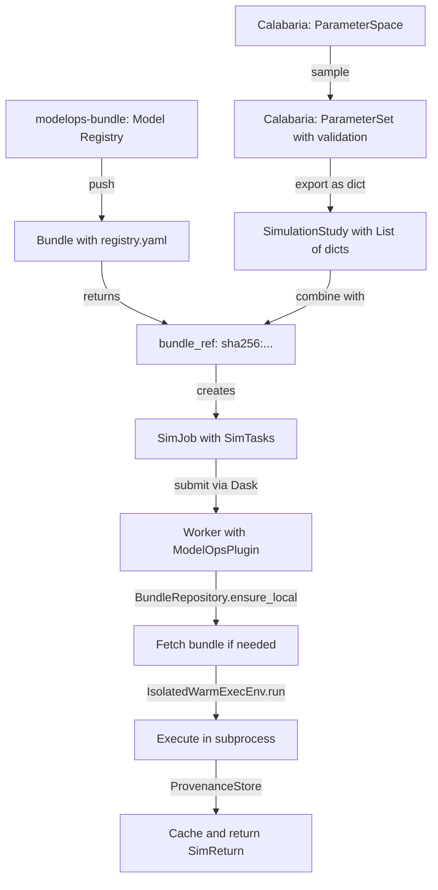

# Simulation Job Execution Flow: From Science to Infrastructure

## Executive Summary

This document traces the complete flow of simulation execution from Calabaria
(science framework) through modelops-bundle (registry/packaging) to ModelOps
(infrastructure orchestration). It identifies redundancies in the current
design and proposes simplifications to create a cleaner, more maintainable
architecture.

## Current Architecture

### 1. Science Phase (Calabaria)

**Location**: `modelops-calabaria` package

Calabaria generates parameter designs for simulations completely decoupled from infrastructure:

```python
# Calabaria's rich parameter types (CORRECT - keep these)
@dataclass(frozen=True)
class ParameterSpec:
    name: str
    kind: str  # 'continuous', 'discrete', 'categorical'
    min: float
    max: float
    doc: str

@dataclass(frozen=True)
class ParameterSpace:
    specs: list[ParameterSpec]
    # Validation, transformation methods

@dataclass(frozen=True)
class ParameterSet:
    space: ParameterSpace  # Reference to space for validation
    values: Dict[str, Scalar]
    # Validates against space on creation
```

**Current Issue**: Calabaria CLI (`cli/sampling.py:90`) incorrectly uses
`modelops_contracts.ParameterSet` instead of its own:

```python
# WRONG - using contracts ParameterSet
from modelops_contracts import SimulationStudy, ParameterSet

# Creates study with wrong ParameterSet type
parameter_sets.append(ParameterSet(params=clean_params))  # Just wraps dict!
```

**Output**: `SimulationStudy` - a bundle-agnostic experiment design

```python
@dataclass(frozen=True)
class SimulationStudy:
    model: str  # e.g., "epi.models"
    scenario: str  # e.g., "baseline"
    parameter_sets: List[ParameterSet]  # Currently wrong type!
    sampling_method: str  # "sobol", "grid", etc.
    n_replicates: int
    outputs: Optional[List[str]]
```

### 2. The Model Registry Phase (modelops-bundle)

**Location**: `modelops-bundle` package

Models get registered with their code, data, and metadata:

```yaml
# .modelops-bundle/registry.yaml (travels WITH bundle)
version: '1.0'
models:
  model_stochasticsir:
    entrypoint: model:StochasticSIR
    path: src/model.py
    class_name: StochasticSIR
    scenarios: []
    parameters: []
    outputs: []
    data:
    - data/data.csv
    data_digests:
      data/data.csv: sha256:4f964a58ca00...
    model_digest: sha256:448dc295027b...
```

**Key Insight**: The model registry is NOT a centralized service - it's
metadata that travels WITH each bundle. This enables reproducibility and
versioning.

**Bundle Operations**:

```python
# Push bundle to OCI registry
bundle_ref = bundle_client.push("ghcr.io/org/epi-models:latest")
# Returns: sha256:abc123...

# Bundle ref is a content-addressed digest
# Registry metadata travels inside the bundle
```

### 3. Job Creation Phase (ModelOps Client)

**Location**: `modelops/client/job_submission.py`

This is where SimulationStudy (parameters) meets Bundle (code/data):

```python
class JobSubmissionClient:
    def submit_study(
        self,
        study: SimulationStudy,  # From Calabaria
        bundle_ref: str,          # From modelops-bundle
        cluster_endpoint: str
    ) -> str:
        # Convert study to SimJob
        sim_job = study.to_simjob(
            bundle_ref=bundle_ref,
            job_id=self._generate_job_id()
        )

        # Current structure (OVERCOMPLICATED):
        # SimJob
        #   └── SimBatch (always 1:1 with job!)
        #       └── List[SimTask]

        # Submit to cluster
        return self._submit_to_cluster(sim_job)
```

### 4. Task Distribution Phase (ModelOps/Dask)

**Location**: `modelops/services/dask_simulation.py`

SimTasks get distributed to workers via Dask:

```python
def _worker_run_task(task: SimTask) -> SimReturn:
    """Runs ON WORKER using plugin-initialized runtime."""
    worker = get_worker()
    return worker.modelops_runtime.execute(task)

class DaskSimulationService:
    def submit(self, task: SimTask) -> Future[SimReturn]:
        # SimTask is heavyweight but needs ALL this info:
        # - bundle_ref: to fetch code/data
        # - entrypoint: what to run
        # - params: with stable param_id
        # - seed: for reproducibility
        # - outputs: what to extract
        # - config/env: runtime settings

        dask_future = self.client.submit(
            _worker_run_task,
            task,
            key=f"sim-{task.seed}-{task.bundle_ref[:12]}"
        )
        return DaskFutureAdapter(dask_future)
```

### 5. Worker Execution Phase

**Location**: `modelops/worker/plugin.py` and `modelops/adapters/exec_env/isolated_warm.py`

Workers are pre-initialized with execution environment via Dask plugin:

```python
class ModelOpsWorkerPlugin(WorkerPlugin):
    def setup(self, worker):
        # Wiring happens ONCE per worker
        config = RuntimeConfig.from_env()

        # Create bundle repository (file or OCI)
        if config.bundle_source == 'oci':
            # TODOHERE: OCIBundleRepository not implemented yet!
            repo_class = oci_plugin.load()
            bundle_repo = repo_class(
                registry_ref=config.bundle_registry,
                cache_dir=config.bundles_cache_dir
            )
        else:
            bundle_repo = FileBundleRepository(...)

        # Create execution environment
        exec_env = IsolatedWarmExecEnv(
            bundle_repo=bundle_repo,
            venvs_dir=Path(config.venvs_dir),
            storage_dir=storage_dir
        )

        # Create executor
        executor = SimulationExecutor(exec_env)
        worker.modelops_runtime = executor
```

**Task Execution**:
```python
class IsolatedWarmExecEnv(ExecutionEnvironment):
    def run(self, task: SimTask) -> SimReturn:
        # 1. Check provenance cache
        stored = self.provenance.get_sim(task)
        if stored:
            return stored

        # 2. Resolve bundle (fetch if needed)
        digest, bundle_path = self._resolve_bundle(task.bundle_ref)

        # 3. Execute in isolated subprocess with warm pool
        raw_artifacts = self._process_manager.execute_task(
            bundle_digest=digest,
            bundle_path=bundle_path,
            entrypoint=str(task.entrypoint),
            params=dict(task.params.params),  # UniqueParameterSet → dict
            seed=task.seed
        )

        # 4. Create return and cache
        result = self._create_sim_return(task, raw_artifacts)
        self.provenance.put_sim(task, result)
        return result
```

## Type Hierarchy Analysis

### Current Problems

1. **Redundant ParameterSet in contracts**:
   ```python
   # modelops_contracts/study.py
   @dataclass(frozen=True)
   class ParameterSet:
       params: Dict[str, Any]  # Just wraps a dict!
   ```
   This adds NO value - it's just a dict wrapper.

2. **Unnecessary SimBatch layer**:
   ```python
   @dataclass(frozen=True)
   class SimJob:
       job_id: str
       batches: List[SimBatch]  # Always exactly 1!

   @dataclass(frozen=True)
   class SimBatch:
       batch_id: str
       tasks: List[SimTask]  # Could be directly in SimJob!
   ```

3. **Calabaria using wrong ParameterSet**:
   - Should use its own rich ParameterSet with validation
   - Currently imports from contracts (the weak one)
   - Loses validation and transformation capabilities

### Proposed Simplification

```python
# REMOVE from modelops_contracts:
# - ParameterSet class (redundant wrapper)
# - SimBatch class (unnecessary layer)

# KEEP in modelops_contracts:
@dataclass(frozen=True)
class UniqueParameterSet:
    """Parameters with stable ID - this is needed for cloud execution."""
    params: Dict[str, Scalar]
    param_id: str  # Stable hash for caching

    @classmethod
    def from_dict(cls, params: Dict[str, Any]) -> "UniqueParameterSet":
        param_id = make_param_id(params)
        return cls(params=params, param_id=param_id)

@dataclass(frozen=True)
class SimTask:
    """Unit of execution - needs all this info at worker."""
    bundle_ref: str  # Where to get code/data
    entrypoint: EntryPointId  # What to run
    params: UniqueParameterSet  # With stable ID
    seed: int  # For reproducibility
    outputs: Optional[Sequence[str]]  # What to extract
    config: Optional[Mapping[str, Any]]  # Runtime config
    env: Optional[Mapping[str, Any]]  # Environment

@dataclass(frozen=True)
class SimulationStudy:
    """Bundle-agnostic experiment design from Calabaria."""
    model: str
    scenario: str
    parameter_sets: List[Dict[str, Any]]  # Just dicts, no wrapper!
    sampling_method: str
    n_replicates: int
    outputs: Optional[List[str]]

    def to_tasks(self, bundle_ref: str, entrypoint: str) -> List[SimTask]:
        """Convert to executable tasks."""
        tasks = []
        for param_dict in self.parameter_sets:
            # Convert dict → UniqueParameterSet here
            unique_params = UniqueParameterSet.from_dict(param_dict)
            for replicate in range(self.n_replicates):
                tasks.append(SimTask(
                    bundle_ref=bundle_ref,
                    entrypoint=entrypoint,
                    params=unique_params,
                    seed=self._compute_seed(unique_params.param_id, replicate),
                    outputs=self.outputs
                ))
        return tasks

# Simpler job structure
@dataclass(frozen=True)
class SimJob:
    """Job submitted to infrastructure."""
    job_id: str
    tasks: List[SimTask]  # Direct, no batch wrapper!
    metadata: Dict[str, Any]
```

## Data Flow Summary



## Refactor Plan

### Phase 1: Fix Immediate Issues
1. **Fix Calabaria CLI** - Stop using contracts ParameterSet
2. **Implement OCIBundleRepository** - Complete the TODOHERE in plugin.py
3. **Add proper serialization** - Replace manual dict conversion

### Phase 2: Simplify Type Hierarchy
1. **Remove contracts.ParameterSet** - Just use dicts in SimulationStudy
2. **Remove SimBatch** - Put tasks directly in SimJob
3. **Update SimulationStudy.to_tasks()** - Direct conversion without batch

### Phase 3: Clean Integration
1. **Calabaria exports**: ParameterSet → dict → SimulationStudy
2. **ModelOps converts**: dict → UniqueParameterSet in SimTask
3. **Workers execute**: SimTask with all needed info

## What SimTask Needs at Each Stage

### At Submission (Client → Cluster)
- `bundle_ref`: To identify code version
- `entrypoint`: To know what to run
- `params` with `param_id`: For deduplication and caching
- `seed`: For reproducibility

### At Distribution (Dask Scheduler)
- Task key for dashboard grouping
- Pure=False for unique execution
- All fields for serialization to worker

### At Execution (Worker)
- `bundle_ref`: To fetch code via BundleRepository
- `entrypoint`: To import and run correct function
- `params.params`: Dict to pass to simulation
- `seed`: To initialize RNG
- `outputs`: To know what to extract
- `config/env`: For runtime settings

### At Caching (ProvenanceStore)
- Full SimTask for cache key generation
- Stable param_id for content addressing
- Bundle digest for invalidation

## Implementation Status

### ✅ Completed (October 2025)

1. **Removed contracts.ParameterSet** - Was just a dict wrapper
2. **Removed SimBatch** - Eliminated unnecessary 1:1 layer with SimJob
3. **Fixed Calabaria CLI** - Now uses plain dicts instead of contracts.ParameterSet
4. **Updated SimJob** - Now has `tasks` directly, no batch wrapper
5. **Updated SimulationStudy** - Uses `List[Dict[str, Any]]` for parameter_sets

### 🚧 Still Needed

1. **ModelOpsBundleRepository** (`modelops/worker/plugin.py:122`)
   - Needs to implement BundleRepository protocol
   - Should integrate with modelops-bundle package
   - Entry point discovery mechanism exists but no implementation
   - Proposed name: `ModelOpsBundleRepository` (not OCIBundleRepository)

2. **Bundle build_and_push** (`modelops-bundle`)
   - JobSubmissionClient expects this method
   - Should build bundle from directory and push to registry
   - Return digest for use as bundle_ref

3. **SimulationStudy serialization** (`modelops-calabaria`)
   - Currently using manual `_study_to_dict()` conversion
   - Should use Pydantic models for proper serialization

## Conclusion

The architecture correctly separates concerns between science (Calabaria),
packaging (modelops-bundle), and infrastructure (ModelOps).

**Refactor completed** (October 2025):
- ✅ Removed contracts.ParameterSet (was just dict wrapper)
- ✅ Removed SimBatch (was always 1:1 with SimJob)
- ✅ Fixed Calabaria to use its own ParameterSet
- ✅ Simplified flow: Study → Job → Task

**Key remaining work**: Implement ModelOpsBundleRepository to enable workers
to fetch bundles from the registry. This is the critical missing piece for
end-to-end execution.

SimTask remains necessarily heavyweight because it carries all information
needed for isolated execution on remote workers. Bundle resolution happens
ON THE WORKER via BundleRepository, not at submission time, which enables
efficient caching and distribution.
